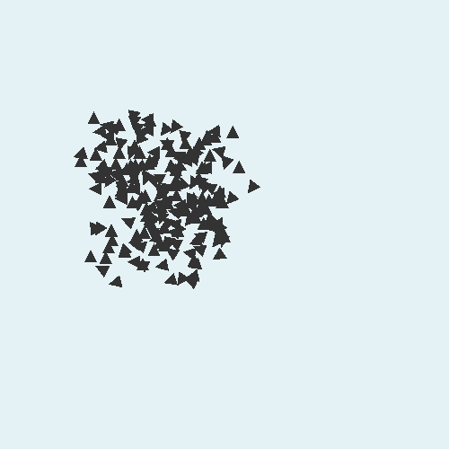

# BoidSim

BoidSim is a OpenGL application simulating emergent behaviour of independent agents. In particular, it simulates flocking behaviour in groups of boids (read birds) and is based on [Reynolds Model](https://www.red3d.com/cwr/papers/1987/boids.html).

The idea is to achieve complex group behaviours from simple rules for each agent. Below an example is shown (no rules has been implemented for the agents).

## Dependencies

- [GLFW](https://www.glfw.org/): for creating windows and retrieving input.
- [GLAD](https://glad.dav1d.de/): for support across different platforms.
- [GLM](https://glm.g-truc.net/0.9.9/index.html): for vector and matrix transformations etc.

## Installation

Windows:

You will need the dependencies mentioned above to run the project.

1. Inside solutions directory (BoidSim) create folder "Dependencies"
2. Inside "Dependencies", create folder "include" and "lib-vc2015"
3. Copy include folders (GLAD, GLFW, GLM, KHR) to include folder
4. Copy "glfw3.lib" to "lib-vc2015"

- [Guide to get the dependency files](https://www.youtube.com/watch?v=k9LDF016_1A) (GLM is not mentioned here)

## Release History

* 0.0.1
    * Randomly spawned triangles with random velocity (no rules implemented)