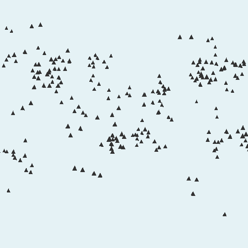
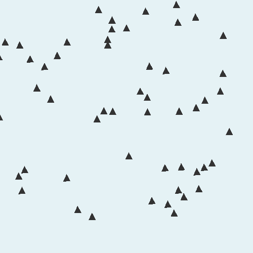

# BoidSim

BoidSim is a OpenGL application simulating emergent behaviour of independent agents. In particular, it simulates flocking behaviour in groups of boids (read birds) and is based on [Reynolds Model](https://www.red3d.com/cwr/papers/1987/boids.html).

The idea is to achieve complex group behaviours from simple rules for each agent.

## Dependencies

- [GLFW](https://www.glfw.org/): for creating windows and retrieving input.
- [GLAD](https://glad.dav1d.de/): for support across different platforms.
- [GLM](https://glm.g-truc.net/): for vector and matrix transformations etc.

## Installation

### Windows/Visual Studio 2017:

1. Create a new empty project called "BoidSim"
2. Copy the files from BoidSim/BoidSim (repository) to BoidSim/BoidSim (your local destination)  
3. [Install dependencies](https://www.youtube.com/watch?v=k9LDF016_1A)
4. [Download GLM](https://glm.g-truc.net/) and drag the glm folder (the one with the .hpp files) to your include folder

## Progress

The following animations demonstrate the progression of our project. The leftmost image demonstrates the most recent change.

